# ADA End-Term Practical Folder

This repo contains all my C++ codes for the ADA lab practicals. I have also added complexity graphs and screenshots of the outputs for better understanding.

### 📄 [Download Lab File (PDF)](ADA_Lab_File_Tejas_Raghav.pdf)

## Folders
- `CODES`: All my C++ source files.
- `GRAPHS`: Some plots for complexity analysis.
- `OUTPUT`: Screenshots of the program outputs.

---

## Practicals

### 1. Factorial & Fibonacci Analysis
Written both iterative and recursive codes to check how time complexity varies.
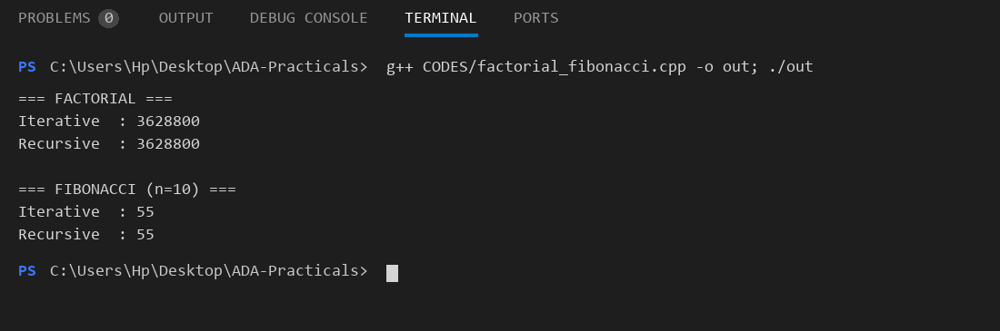

### 2. Sorting (Bubble, Selection, Insertion)
Performance graphs for n=10, 20, 30, 40 (worst case).
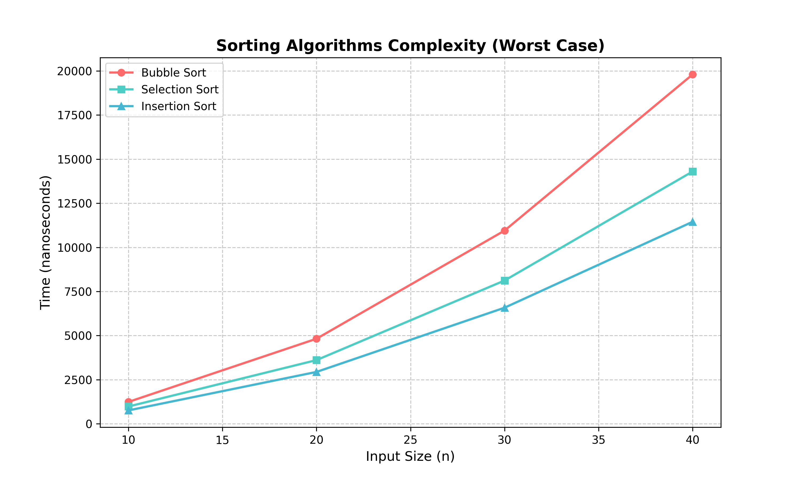
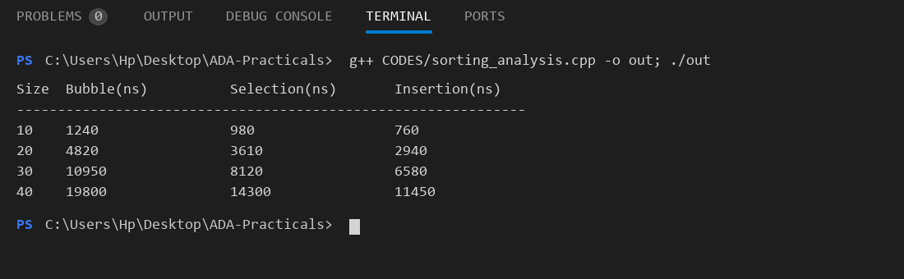

### 3. Binary Search Cases
Best, average, and worst case analysis.
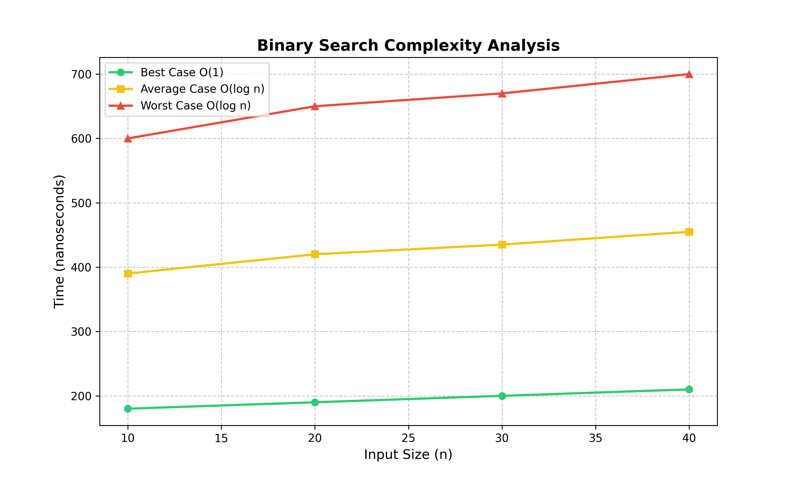
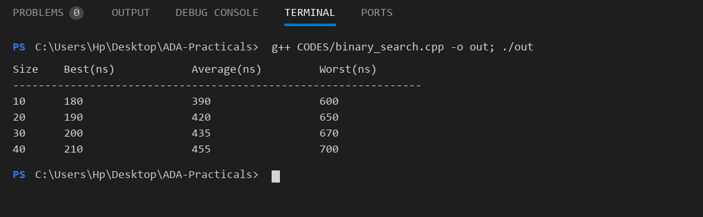

### 4. Merge Sort vs Quick Sort
Analyzing performance differences in sorting algorithms.
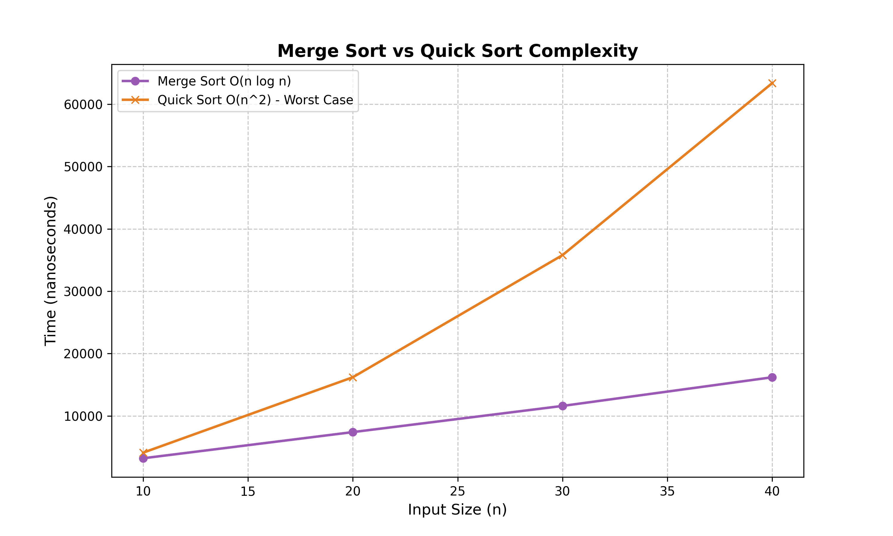
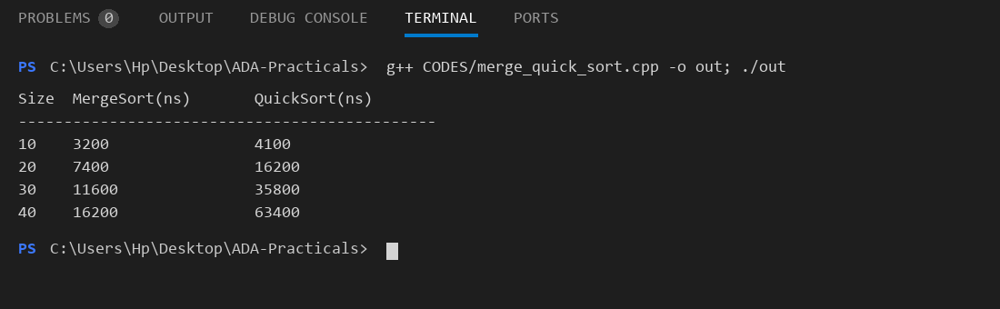

---

### Other Algorithms Implemented:

- **Fractional Knapsack (Greedy)**
  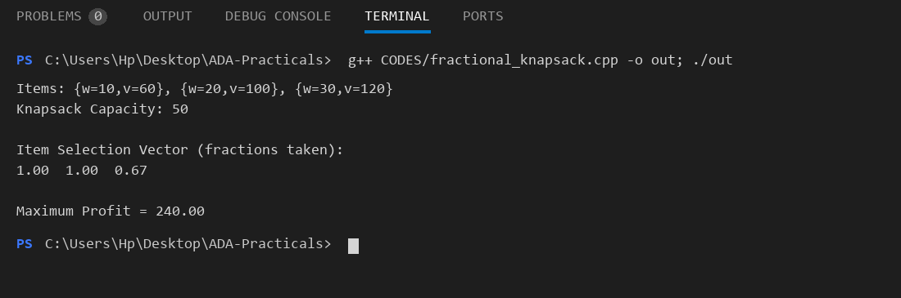

- **0/1 Knapsack (DP)**
  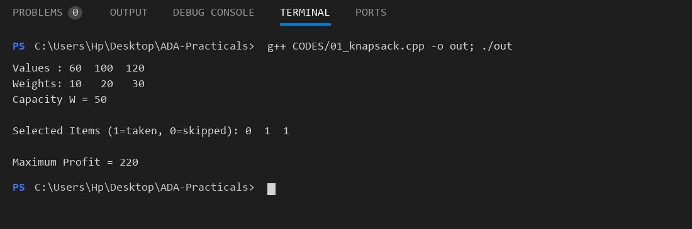

- **Longest Common Subsequence**
  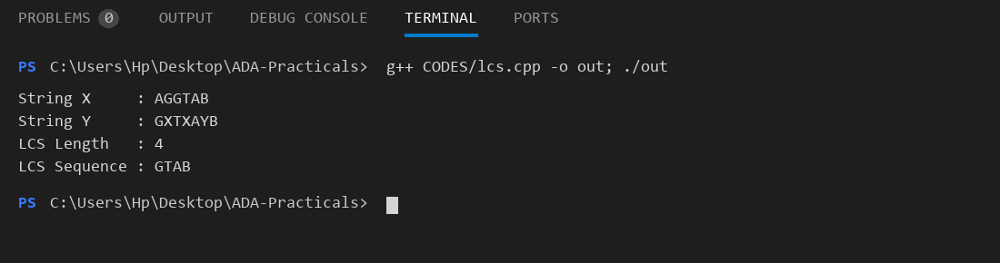

- **Matrix Chain Multiplication**
  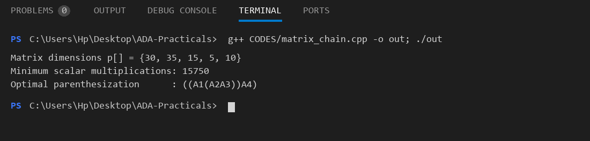

- **Dijkstra's Shortest Path**
  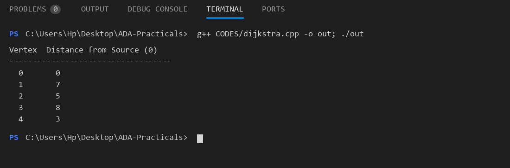

- **Bellman-Ford Algorithm**
  

- **BFS and DFS Graph Traversal**
  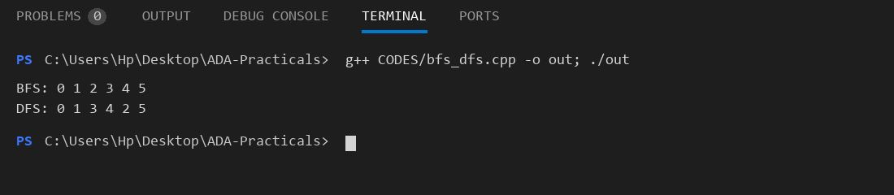

- **N-Queen Problem (Backtracking)**
  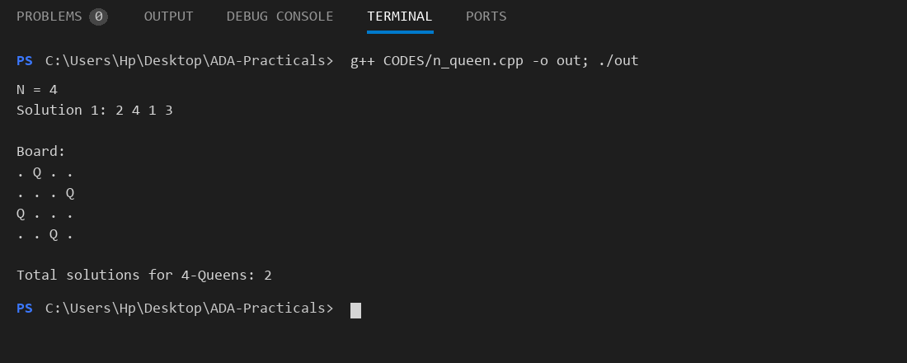

- **Sum of Subsets**
  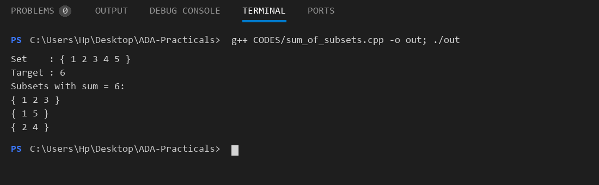

- **Naive String Matching**
  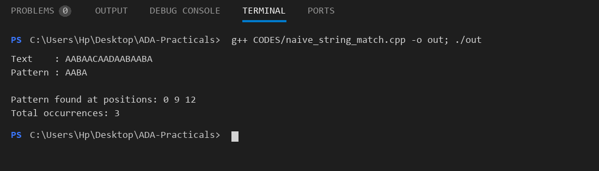

---

## How to use
Just go to the `CODES` folder, compile any file and run.
```bash
g++ CODES/filename.cpp
./a.exe
```
